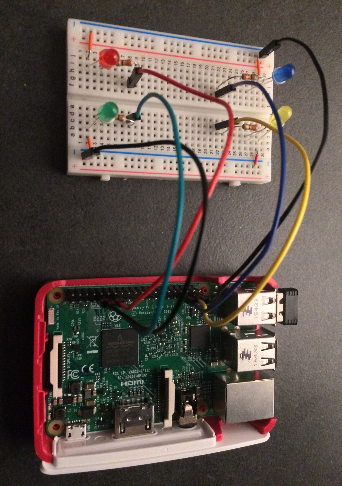

# Voice control light system

Controlling led lights with [Html5 Web Speech API](https://developer.mozilla.org/en-US/docs/Web/API/Web_Speech_API) using raspberry pi!

### For this project you will need:

1. Raspberry pi (pi 3 is used here).

2. A breadboard.

3. 4 Led lights (blue, red, green, yellow).

4. 4 resistors (between 270ohms - 320ohms).

5. and the jumper wires

### To get this project running

1. clone the project (on your raspberry-pi)

2. `npm install`

3. `node server` will start a web server on port 3000

4. On another terminal type `sudo ifconfig` to see your IP address on wlan0 (Note: It changes every time you boot the pi!)

    Note: Web speech api works currently only on chrome and firefox. If you (most probably) don't have chrome on your pi; you can
    simply start the application from your laptop or desktop that is connected to same network with your raspberry-pi.

5. On your laptop/desktop: open chrome and browse the pi IP address and the server port after it. Like: **192.168.2.10:3000**

    Note: There is one more challenge! Chrome will not allow you to make http calls due to the same-origin-policy. To fix that:
    Simply install [This plug-in](https://chrome.google.com/webstore/detail/allow-control-allow-origi/nlfbmbojpeacfghkpbjhddihlkkiljbi?hl=en)
    on your chrome browser. As you start the application on a page, click on the (CORS) icon right up on the corner and now you can send
    the commands to the node server.

6. Allow the browser to use your microphone as it is asked and click on the text to speak your command.

### Voice commands:

- **Lights on**: Turns all the lights on.

- **Lights off**: Turns all the lights off.

- **Blue on**: Turns the blue light on.

- **Blue off**: Turns the blue light off.

- **Green on**: Turns the green light on.

- **Green off**: Turns the Green light off.

- **Red on**: Turns the Red light on.

- **Red off**: Turns the Red light off.

- **Yellow on**: Turns the Yellow light on.

- **Yellow off**: Turns the Yellow light off.

### Wiring raspberry pi and the led lights on breadboard

> **Led blue** to Gpio pin 19

> **Led green** to Gpio pin 17

> **Led red** to Gpio pin 27

> **Led yellow** to Gpio pin 16

> Black wires are connected to **Ground**

